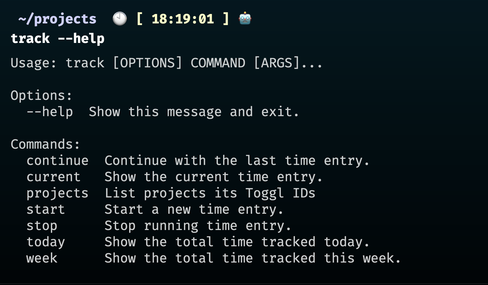

# track - A Toggl Track personal CLI

[](https://oclif.io)
[](https://codecov.io/gh/ulisesantana/track)
[](https://github.com/ulisesantana/track/actions/workflows/test.yml)
[](https://github.com/ulisesantana/track/blob/main/LICENSE)

<!-- toc -->
* [track - A Toggl Track personal CLI](#track---a-toggl-track-personal-cli)
* [Usage](#usage)
* [Commands](#commands)
<!-- tocstop -->
# Usage
<!-- usage -->
```sh-session
$ npm install -g @ulisesantana/track
$ track COMMAND
running command...
$ track (--version)
@ulisesantana/track/1.0.6 darwin-arm64 node-v20.6.0
$ track --help [COMMAND]
USAGE
  $ track COMMAND
...
```
<!-- usagestop -->
# Commands
<!-- commands -->
* [`track autocomplete [SHELL]`](#track-autocomplete-shell)
* [`track config`](#track-config)
* [`track continue`](#track-continue)
* [`track current`](#track-current)
* [`track help [COMMANDS]`](#track-help-commands)
* [`track set description`](#track-set-description)
* [`track set project`](#track-set-project)
* [`track set token`](#track-set-token)
* [`track set workspace`](#track-set-workspace)
* [`track setup`](#track-setup)
* [`track start [DESCRIPTION]`](#track-start-description)
* [`track stop`](#track-stop)
* [`track today`](#track-today)
* [`track week`](#track-week)
* [`track yesterday`](#track-yesterday)

## `track autocomplete [SHELL]`

Display autocomplete installation instructions.

```
USAGE
  $ track autocomplete [SHELL] [-r]

ARGUMENTS
  SHELL  (zsh|bash|powershell) Shell type

FLAGS
  -r, --refresh-cache  Refresh cache (ignores displaying instructions)

DESCRIPTION
  Display autocomplete installation instructions.

EXAMPLES
  $ track autocomplete

  $ track autocomplete bash

  $ track autocomplete zsh

  $ track autocomplete powershell

  $ track autocomplete --refresh-cache
```

_See code: [@oclif/plugin-autocomplete](https://github.com/oclif/plugin-autocomplete/blob/v3.0.3/src/commands/autocomplete/index.ts)_

## `track config`

Get your config for track.

```
USAGE
  $ track config

DESCRIPTION
  Get your config for track.

EXAMPLES
  $ track config
```

_See code: [src/commands/config.ts](https://github.com/ulisesantana/track/blob/v1.0.6/src/commands/config.ts)_

## `track continue`

Continue with last time entry.

```
USAGE
  $ track continue

DESCRIPTION
  Continue with last time entry.

EXAMPLES
  $ track continue
```

_See code: [src/commands/continue.ts](https://github.com/ulisesantana/track/blob/v1.0.6/src/commands/continue.ts)_

## `track current`

Show running time entry.

```
USAGE
  $ track current

DESCRIPTION
  Show running time entry.

EXAMPLES
  $ track current
```

_See code: [src/commands/current.ts](https://github.com/ulisesantana/track/blob/v1.0.6/src/commands/current.ts)_

## `track help [COMMANDS]`

Display help for track.

```
USAGE
  $ track help [COMMANDS] [-n]

ARGUMENTS
  COMMANDS  Command to show help for.

FLAGS
  -n, --nested-commands  Include all nested commands in the output.

DESCRIPTION
  Display help for track.
```

_See code: [@oclif/plugin-help](https://github.com/oclif/plugin-help/blob/v5.2.20/src/commands/help.ts)_

## `track set description`

Set your default time entry description for track.

```
USAGE
  $ track set description

DESCRIPTION
  Set your default time entry description for track.

EXAMPLES
  $ track set description
```

_See code: [src/commands/set/description.ts](https://github.com/ulisesantana/track/blob/v1.0.6/src/commands/set/description.ts)_

## `track set project`

Setup your default project for track.

```
USAGE
  $ track set project

DESCRIPTION
  Setup your default project for track.

EXAMPLES
  $ track set project
```

_See code: [src/commands/set/project.ts](https://github.com/ulisesantana/track/blob/v1.0.6/src/commands/set/project.ts)_

## `track set token`

Setup your Toggl Track API token for track.

```
USAGE
  $ track set token

DESCRIPTION
  Setup your Toggl Track API token for track.

EXAMPLES
  $ track set token
```

_See code: [src/commands/set/token.ts](https://github.com/ulisesantana/track/blob/v1.0.6/src/commands/set/token.ts)_

## `track set workspace`

Setup your default workspace for track.

```
USAGE
  $ track set workspace

DESCRIPTION
  Setup your default workspace for track.

EXAMPLES
  $ track set workspace
```

_See code: [src/commands/set/workspace.ts](https://github.com/ulisesantana/track/blob/v1.0.6/src/commands/set/workspace.ts)_

## `track setup`

Setup your config for track.

```
USAGE
  $ track setup

DESCRIPTION
  Setup your config for track.

EXAMPLES
  $ track setup
```

_See code: [src/commands/setup.ts](https://github.com/ulisesantana/track/blob/v1.0.6/src/commands/setup.ts)_

## `track start [DESCRIPTION]`

Start a new time entry.

```
USAGE
  $ track start [DESCRIPTION] [-i] [-p <value>]

ARGUMENTS
  DESCRIPTION  Time entry description.

FLAGS
  -i, --interactive      Create time entry interactively
  -p, --project=<value>  Project ID or Project name

DESCRIPTION
  Start a new time entry.

EXAMPLES
  $ track start -i

  $ track start Working -p "Your project"
```

_See code: [src/commands/start.ts](https://github.com/ulisesantana/track/blob/v1.0.6/src/commands/start.ts)_

## `track stop`

Stop running time entry.

```
USAGE
  $ track stop

DESCRIPTION
  Stop running time entry.

EXAMPLES
  $ track stop
```

_See code: [src/commands/stop.ts](https://github.com/ulisesantana/track/blob/v1.0.6/src/commands/stop.ts)_

## `track today`

Show time entries run today.

```
USAGE
  $ track today

DESCRIPTION
  Show time entries run today.

EXAMPLES
  $ track today
```

_See code: [src/commands/today.ts](https://github.com/ulisesantana/track/blob/v1.0.6/src/commands/today.ts)_

## `track week`

Show time entries run current week.

```
USAGE
  $ track week

DESCRIPTION
  Show time entries run current week.

EXAMPLES
  $ track week
```

_See code: [src/commands/week.ts](https://github.com/ulisesantana/track/blob/v1.0.6/src/commands/week.ts)_

## `track yesterday`

Show time entries run yesterday.

```
USAGE
  $ track yesterday

DESCRIPTION
  Show time entries run yesterday.

EXAMPLES
  $ track yesterday
```

_See code: [src/commands/yesterday.ts](https://github.com/ulisesantana/track/blob/v1.0.6/src/commands/yesterday.ts)_
<!-- commandsstop -->



## Install
Add to your .zshenv:
```env
export TOGGL_API_TOKEN="email:password"
export TOGGL_WORKSPACE_ID=1234567890
export TOGGL_DEFAULT_TIME_ENTRY="Doing stuff"
export TOGGL_DEFAULT_PROJECT=1234567890
```

Install in your shell (requires Python >= 3.9.6):
```shell
poetry build
pip install dist/track-0.1.0.tar.gz
```
